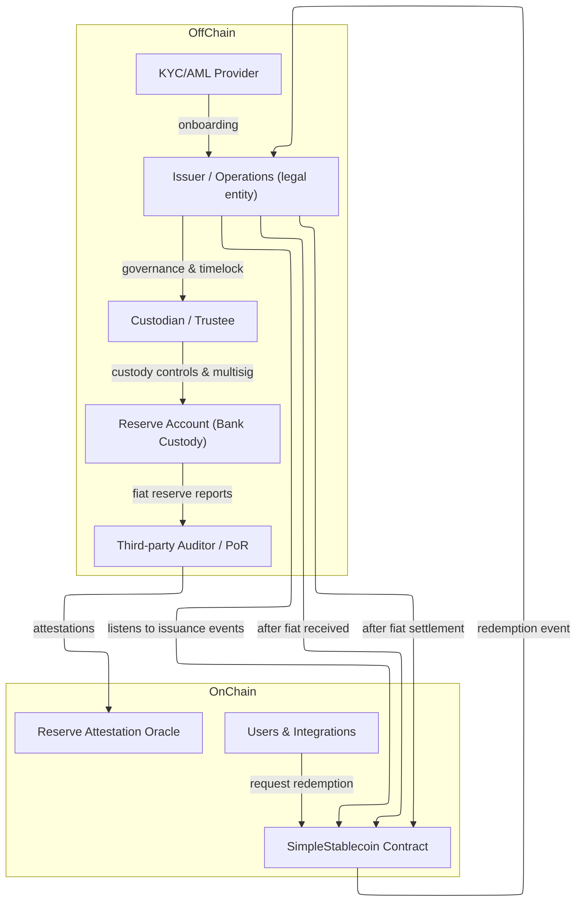

# Architecture - MiCAR-aware Stablecoin System (Proof-of-Concept)

This document describes the high-level architecture of a conservative, EUR-backed stablecoin system designed with EU regulatory expectations (MiCAR-era) in mind.

The focus is not on financial engineering, but on **clear separation of responsibilities**, **operational safety**, and **auditability across on-chain and off-chain boundaries**.

> **⚠️ Implementation Status**: This document describes a **production-grade architecture** to demonstrate system design thinking. The current PoC implementation includes:
> - ✅ Core ERC-20 token with privileged mint/burn
> - ✅ Issuer and Owner role separation
> - ✅ Pause mechanism for emergency controls
> - ✅ Event-driven issuance and redemption signaling
>
> **Not yet implemented** (conceptual/aspirational):
> - ⏳ Reserve Attestation Oracle
> - ⏳ Multisig governance mechanisms
> - ⏳ Timelock controls
> - ⏳ KYC/AML integration contracts
>
> This distinction is intentional: the document shows architectural judgment for a production system, while the code demonstrates core token mechanics.

## Design principles

- **Separation of duties**  
  Issuance, custody, auditing, and compliance are intentionally split across systems and roles.

- **Off-chain settlement first**  
  Fiat always moves before on-chain minting or burning.

- **Event-driven, not automated finance**  
  Smart contracts emit signals; humans and regulated entities execute decisions.

- **Recoverability over cleverness**  
  Pause controls, clear ownership, and auditable flows are preferred over algorithmic peg mechanisms.

## System components

### Off-chain

- **Issuer / Operations (Legal Entity)**  
  Responsible for issuing and redeeming tokens, managing compliance workflows, and operating on-chain keys under governance.

- **Bank Custody / Reserve Account**  
  Holds fiat reserves backing the stablecoin supply. No smart contract has direct access.

- **Custodian / Trustee**  
  Provides custody controls, multisig governance, and separation between operational staff and reserves.

- **KYC / AML Provider**  
  Handles onboarding, sanctions screening, and transaction monitoring for fiat on/off-ramps.

- **Third-party Auditor (Proof-of-Reserves)**  
  Verifies reserve balances and issues attestations consumed by transparency systems.

### On-chain

- **SimpleStablecoin Contract**  
  ERC-20 compatible token with controlled minting and burning, pause functionality, and event-based signalling.

- **Reserve Attestation Oracle**  
  Publishes auditor attestations on-chain for transparency and monitoring.

- **Users & Integrations**  
  Holders, wallets, and application integrations interacting with the token.

## Architecture diagram

## Happy-path flows

### Issuance

1. User completes KYC/AML and deposits EUR with the issuer or custodian.
2. Fiat settlement is confirmed off-chain.
3. Issuer triggers on-chain minting of stablecoins.
4. Tokens are delivered to the user’s address.

### Redemption

1. User calls a redemption request function on-chain.
2. Event is reviewed by issuer operations.
3. Fiat is transferred to the user off-chain.
4. Tokens are burned on-chain to reduce supply.

## Trust boundaries

- Smart contracts **do not** control fiat or reserves.
- Oracles and attestations are informational, not authoritative.
- Final accountability remains with regulated legal entities.

## Non-goals

- Algorithmic pegs or autonomous monetary policy
- Yield generation or reserve rehypothecation
- Permissionless minting or redemption
- Cross-chain complexity

## Why this architecture works for EU contexts

This design aligns well with regulator expectations by:
- Making reserve custody explicit and auditable
- Avoiding automated financial risk
- Supporting human-in-the-loop compliance decisions
- Allowing clear incident response and system shutdown

At scale, this architecture prioritizes **trust, clarity, and recoverability** over speed or novelty.
